# Second Brain Telegram AWS - Architecture Documentation

This document follows the [arc42](https://arc42.org/) template for software architecture documentation.

---

## 1. Introduction and Goals

### 1.1 Requirements Overview

Second Brain Telegram AWS is a personal knowledge management system that captures thoughts via Telegram and processes them with AI, storing insights in DynamoDB with automated digest summaries.

**Core functionality:**
- Capture thoughts in seconds via Telegram messages
- AI-powered classification into four categories (People, Projects, Ideas, Admin)
- Extraction of structured fields (name, status, next_action, notes)
- Embedding-based deduplication using S3 Vectors
- Automated daily and weekly digest summaries

### 1.2 Quality Goals

| Priority | Quality Goal | Description |
|----------|--------------|-------------|
| 1 | Low Friction Capture | Capturing a thought must take <5 seconds with zero decisions |
| 2 | Reliable Classification | AI must correctly categorize >90% of inputs |
| 3 | Proactive Surfacing | System pushes relevant information without user action |
| 4 | Cost Efficiency | Monthly cost should remain $0-5 for personal use |
| 5 | Maintainability | Solo developer should be able to modify system easily |

### 1.3 Stakeholders

| Role | Description | Expectations |
|------|-------------|--------------|
| Solo Developer/User | Single person building and using the system | Zero-friction capture, reliable retrieval, low maintenance |

---

## 2. Constraints

### 2.1 Technical Constraints

| Constraint | Description |
|------------|-------------|
| AWS Serverless | All compute runs on Lambda, storage on DynamoDB/S3 |
| Python 3.12 | Runtime for all Lambda functions |
| uv Package Manager | Modern Python dependency management |
| CDK for Infrastructure | All AWS resources defined as Infrastructure as Code |

### 2.2 Organizational Constraints

| Constraint | Description |
|------------|-------------|
| Personal Project | Single developer, no team coordination required |
| Cost-Conscious | Target $0-5/month, pay-per-use billing essential |
| Open Source | MIT licensed, publicly visible on GitHub |

### 2.3 Conventions

The system follows principles from [Building a Second Brain](https://www.buildingasecondbrain.com/) by Tiago Forte, specifically:

- **One reliable behavior**: User only needs to message the bot
- **Routing over organizing**: AI classifies, user doesn't decide
- **Small outputs**: Digests fit on a phone screen
- **Design for restart**: No backlog guilt when resuming

---

## 3. Context and Scope

### 3.1 Business Context

```mermaid
flowchart TB
    subgraph External
        User[👤 User]
        Telegram[📱 Telegram App]
    end

    subgraph "Second Brain System"
        SB[🧠 Second Brain<br/>AWS Services]
    end

    subgraph "AI Providers"
        Anthropic[Anthropic Claude]
        OpenAI[OpenAI GPT]
        Bedrock[AWS Bedrock]
    end

    User -->|"Sends thoughts"| Telegram
    Telegram -->|"Webhook"| SB
    SB -->|"Classification<br/>& Summarization"| Anthropic
    SB -.->|"Fallback"| OpenAI
    SB -.->|"Fallback + Embeddings"| Bedrock
    SB -->|"Digests"| Telegram
    Telegram -->|"Notifications"| User
```



**External entities:**

| Entity | Description |
|--------|-------------|
| User | The person capturing thoughts and receiving digests |
| Telegram | Messaging platform providing bot API and mobile interface |
| Anthropic Claude | Primary AI for classification and summarization |
| OpenAI GPT | Secondary fallback AI provider |
| AWS Bedrock | Tertiary fallback for AI, primary for embeddings |

### 3.2 Technical Context


**Technical interfaces:**

| Interface | Protocol | Purpose |
|-----------|----------|---------|
| Telegram Bot API | HTTPS REST | Send/receive messages |
| Lambda Function URL | HTTPS | Public webhook endpoint |
| Anthropic API | HTTPS REST | Classification & summarization |
| OpenAI API | HTTPS REST | Fallback AI provider |
| Bedrock Runtime | AWS SDK | Embeddings & fallback classification |
| S3 Vectors | AWS SDK | Semantic similarity search |

---

## 4. Solution Strategy

### 4.1 Technology Decisions

| Decision | Rationale |
|----------|-----------|
| Serverless Lambda | Zero idle cost, automatic scaling, minimal maintenance |
| DynamoDB | Pay-per-request, flexible schema, native Lambda integration |
| S3 Vectors | Managed vector index, no dedicated vector DB overhead |
| Three-tier AI fallback | Resilience against API failures or rate limits |
| CDK over CloudFormation | Type-safe, reusable, testable infrastructure |
| Telegram over Slack | Personal use friendly, no workspace required, free tier |

### 4.2 Architecture Approach

1. **Event-driven**: Webhook triggers on message, EventBridge triggers digests
2. **Embedding-based deduplication**: Similar messages update existing items
3. **Confidence filtering**: Low-confidence classifications request clarification
4. **Separation of concerns**: Interface (Telegram) / Compute (Lambda) / Memory (DynamoDB)

---

## 5. Building Block View

### 5.1 Level 1: System Context


### 5.2 Level 2: Package Decomposition


**Package responsibilities:**

| Package | Responsibility |
|---------|---------------|
| `cdk` | AWS infrastructure definition (CDK stack) |
| `common` | Shared utilities (env loading, embeddings, logging) |
| `lambdas` | Lambda function handlers and business logic |
| `scripts` | CLI tools for deployment and debugging |

### 5.3 Level 3: Lambda Internals

#### Processor Lambda

| Component | File | Purpose |
|-----------|------|---------|
| Handler | `processor.py:handler` | Webhook entry point, dispatches commands |
| AI Classifiers | `processor.py` | `classify_with_anthropic/openai/bedrock` |
| Command Dispatch | `processor.py:COMMAND_DISPATCH` | Routes `/command` to action handlers |
| Embedding Matcher | `embedding_matcher.py` | Deduplication via S3 Vectors similarity |
| Actions | `actions/*.py` | Individual command implementations |

#### Digest Lambda

| Component | File | Purpose |
|-----------|------|---------|
| Handler | `digest.py:handler` | EventBridge entry point |
| Item Queries | `digest.py` | `get_open_items`, `get_completed_items` |
| Summarizers | `digest.py` | `summarize_with_anthropic/openai` |
| Message Sender | `digest.py` | `send_telegram_message` |

---

## 6. Runtime View

### 6.1 Capture Flow


### 6.2 Digest Flow


### 6.3 Command Dispatch

The processor uses a dispatch table pattern:

```python
COMMAND_DISPATCH = [
    ("/digest", digest),
    ("/open", open_items),
    ("/closed", closed_items),
    ("/debug count", debug_count),
    ("/debug backfill", debug_backfill),
    ("/debug duplicates-auto", debug_duplicates_auto),
    ("/debug duplicates", debug_duplicates),
    ("/merge", merge),
    ("/delete", delete),
    (None, process_action),  # Default: classify message
]
```

---

## 7. Deployment View

### 7.1 Infrastructure Diagram


### 7.2 CDK Stack Resources

| Resource | Type | Purpose |
|----------|------|---------|
| SecondBrainTable | DynamoDB Table | Main data store with StatusIndex GSI |
| SecondBrainVectorBucket | S3 Bucket | Vector embedding storage |
| ProcessorLambda | Lambda Function | Telegram webhook handler |
| DigestLambda | Lambda Function | Scheduled digest generator |
| TaskLinkerLambda | Lambda Function | Task linking with embeddings |
| PythonDepsLayer | Lambda Layer | Shared dependencies (built with Docker) |
| DailyDigestRule | EventBridge Rule | Cron: 8 AM UTC daily |
| WeeklyDigestRule | EventBridge Rule | Cron: 9 AM UTC Sundays |
| TriggerRole | IAM Role | For scripts to invoke Lambdas |

### 7.3 Build Process

```bash
# 1. Build Lambda layer (Docker + uv)
uv run deploy deploy

# Layer build command (inside Docker):
pip install uv && \
uv pip install --requirements pyproject.toml --target /asset-output/python && \
cp -r /common-src/src/common /asset-output/python/
```

### 7.4 Environment Configuration

Required environment variables:

| Variable | Lambda | Scripts | Description |
|----------|--------|---------|-------------|
| `ANTHROPIC_API_KEY` | ✅ | - | Claude API key |
| `OPENAI_API_KEY` | ✅ | - | OpenAI API key (fallback) |
| `TELEGRAM_BOT_TOKEN` | ✅ | ✅ | Bot token from BotFather |
| `TELEGRAM_SECRET_TOKEN` | ✅ | ✅ | Webhook verification secret |
| `USER_CHAT_ID` | ✅ | - | Telegram chat ID for digests |
| `BEDROCK_REGION` | ✅ | - | AWS region for Bedrock |
| `AWS_PROFILE` | - | ✅ | AWS credential profile |
| `AWS_REGION` | - | ✅ | AWS region for CLI |

---

## 8. Crosscutting Concepts

### 8.1 AI Provider Fallback Strategy


Classification uses this fallback chain:
1. **Anthropic Claude** (claude-sonnet-4-20250514) - Primary
2. **OpenAI GPT** (gpt-3.5-turbo) - Secondary
3. **AWS Bedrock** (claude-3-haiku) - Tertiary

### 8.2 Confidence Threshold Filtering

The system extracts a confidence score (0-100) from AI classification:

- **High confidence (≥60)**: Item filed automatically
- **Low confidence (<60)**: Item logged as "needs_review", clarification requested

### 8.3 Embedding Similarity Matching


- Uses `amazon.titan-embed-text-v2:0` for embeddings
- OpenAI `text-embedding-3-small` as fallback
- Similarity threshold: 0.85 (cosine similarity)

### 8.4 Error Handling Patterns

From AGENTS.md guidelines:

1. **Let exceptions propagate** - Users need to see errors
2. **Add context before re-raising** - Log then re-raise
3. **Catch specific exceptions** - Never bare `except:`
4. **Retry with backoff** - For transient API failures

---

## 9. Architecture Decisions

### 9.1 ADR-001: Telegram over Slack

**Context**: Need a low-friction capture interface accessible on mobile.

**Decision**: Use Telegram Bot API instead of Slack.

**Rationale**:
- Personal use doesn't require Slack workspace
- Native mobile experience with push notifications
- Voice message support for future enhancement
- Free tier sufficient for personal use

### 9.2 ADR-002: DynamoDB over RDS

**Context**: Need persistent storage for captured items.

**Decision**: Use DynamoDB with composite keys (PK/SK pattern).

**Rationale**:
- Pay-per-request billing (no idle cost)
- Native Lambda integration
- Flexible schema per category
- GSI supports status-based queries

### 9.3 ADR-003: S3 Vectors over Dedicated Vector DB

**Context**: Need semantic similarity search for deduplication.

**Decision**: Use S3 Vectors (managed vector index on S3).

**Rationale**:
- No additional managed service (Pinecone, Weaviate)
- Integrated with existing S3 bucket
- Sufficient scale for personal use
- Lower operational complexity

### 9.4 ADR-004: CDK over CloudFormation/Terraform

**Context**: Need Infrastructure as Code for AWS resources.

**Decision**: Use AWS CDK with Python.

**Rationale**:
- Type-safe infrastructure definitions
- Same language as Lambda code
- Built-in asset bundling for layers
- Native AWS support without third-party state

### 9.5 ADR-001: Event Sourcing with INBOX_LOG

**Status**: In Progress

**Context**: Need ability to replay all captured messages through new classification logic when adding features, improving AI models, or fixing bugs.

**Decision**: Adopt event sourcing with INBOX_LOG as the source of truth. Categorized items become projections derived from events.

**Rationale**:
- Replayability: Add new features by replaying, not migrating
- Complete audit trail: Nothing is ever lost
- Schema evolution: New fields = replay, not migration scripts
- Experimentation: Try different AI models, compare results

**Full ADR**: [docs/adr/001-event-sourcing-inbox-log.md](./docs/adr/001-event-sourcing-inbox-log.md)

---

## 10. Quality Requirements

### 10.1 Quality Tree

```
Quality
├── Usability
│   ├── Low friction capture (<5 seconds)
│   ├── Zero taxonomy decisions at capture time
│   └── Readable digests on mobile
├── Reliability
│   ├── Three-tier AI fallback
│   ├── Confidence-based filtering
│   └── Audit trail (original_text preserved)
├── Cost Efficiency
│   ├── Pay-per-request DynamoDB
│   ├── Lambda (1M free invocations)
│   └── No idle compute costs
└── Maintainability
    ├── CDK Infrastructure as Code
    ├── Monorepo with workspace packages
    └── CloudWatch logging
```

### 10.2 Quality Scenarios

| ID | Quality | Scenario | Metric |
|----|---------|----------|--------|
| Q1 | Usability | User sends a thought while walking | <5 seconds, one action |
| Q2 | Reliability | Anthropic API is down | Fallback to OpenAI within 5s |
| Q3 | Cost | 100 messages/week, 2 digests/week | <$5/month total |
| Q4 | Maintainability | Add new command handler | Single file addition |

---

## 11. Risks and Technical Debt

### 11.1 Identified Risks

| Risk | Impact | Probability | Mitigation |
|------|--------|-------------|------------|
| S3 Vector Index not in CloudFormation | Manual setup required | High | Script `create_vector_index.py` |
| Function URL public endpoint | Security relies on secret token | Medium | Validate `X-Telegram-Bot-Api-Secret-Token` header |
| AI API costs spike | Budget overrun | Low | Monitor usage, switch to Bedrock-only |
| Telegram rate limits | Missed messages | Low | EventBridge handles scheduling |

### 11.2 Technical Debt

| Item | Description | Priority |
|------|-------------|----------|
| S3 Vector Index manual creation | Cannot be defined in CDK yet | High |
| No data encryption beyond defaults | DynamoDB/S3 use AWS-managed keys | Medium |
| Hardcoded Bedrock region | `us-east-2` in IAM policy | Low |
| No unit tests | Lambda handlers lack test coverage | Medium |

---

## 12. Glossary

| Term | Definition |
|------|------------|
| **Second Brain** | External system for capturing and organizing thoughts (from Tiago Forte) |
| **Capture** | The act of recording a thought quickly without organizing |
| **Classification** | AI-powered categorization into People/Projects/Ideas/Admin |
| **Digest** | Summary of recent items sent proactively to user |
| **Embedding** | Vector representation of text for similarity comparison |
| **Deduplication** | Finding and updating existing items instead of creating duplicates |
| **Confidence Score** | AI's certainty about classification (0-100) |
| **Function URL** | Public HTTPS endpoint for Lambda (no API Gateway) |
| **GSI** | Global Secondary Index in DynamoDB for alternate query patterns |
| **S3 Vectors** | AWS service for vector similarity search on S3 |
| **Webhook** | HTTP callback from Telegram to Lambda on new messages |

---

## References

- [arc42 Template](https://arc42.org/)
- [Building a Second Brain](https://www.buildingasecondbrain.com/)
- [INSPIRATION.md](./INSPIRATION.md) - Design principles from Nate B Jones video
- [AWS CDK Documentation](https://docs.aws.amazon.com/cdk/)
- [Telegram Bot API](https://core.telegram.org/bots/api)
