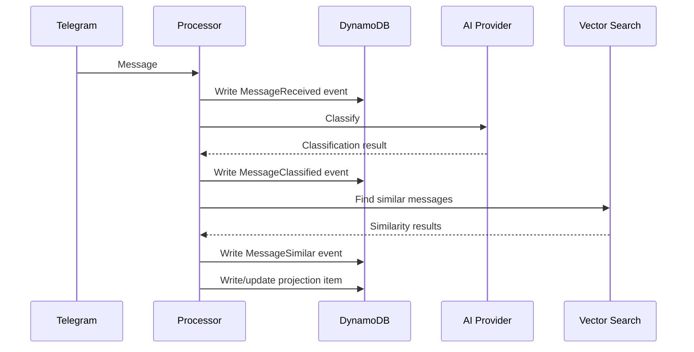

# ADR-001: Event Sourcing with INBOX_LOG

## Status

**Accepted** - 2026-01-17

## Context

The current architecture stores classified items directly as the source of truth. When we want to:
- Add new fields to items
- Improve classification with a better AI model
- Fix bugs in classification logic
- Experiment with different categorization approaches

...we need to write migration scripts or manually update items. The original raw input is preserved in `original_text`, but there's no systematic way to replay all inputs through new logic.

Additionally, there's no complete audit trail of what was captured - only what was successfully classified and stored.

## Decision

Adopt **event sourcing** with two event types in a single DynamoDB table:

1. **MessageReceived**: Raw messages captured exactly as received
2. **MessageClassified**: Classification results with AI metadata
3. **Replay capability**: Rebuild categorized items by replaying events chronologically

### Schema Design

#### Single Table: SecondBrainEvents

**MessageReceived Events:**
```
PK: "EVENT#{source}"          # e.g., "EVENT#telegram"
SK: "{timestamp}#{source_id}" # e.g., "2024-01-17T10:00:00Z#12345"

Attributes:
  - event_type: "MessageReceived"
  - raw_text: string          # Original message, unmodified
  - received_at: string       # ISO timestamp when received
  - source: string            # "telegram" | "email" | "voice"
  - source_id: string         # telegram_message_id for deduplication
  - chat_id: string           # Telegram chat ID
```

**MessageClassified Events:**
```
PK: "EVENT#{source}"          # Same PK as MessageReceived
SK: "{timestamp}#{source_id}#CLASSIFIED#{sequence}"

Attributes:
  - event_type: "MessageClassified"
  - classification: "People"|"Projects"|"Ideas"|"Admin"
  - confidence_score: number
  - classified_by: string     # Model: "claude-sonnet-4-20250514"
  - classified_at: string     # ISO timestamp
  - item_pk: string          # FK to derived item: "PEOPLE#john-doe"
  - item_sk: string          # FK to derived item: "PROFILE"
```

**MessageSimilar Events:**
```
PK: "EVENT#{source}"          # Same PK as MessageReceived
SK: "{timestamp}#{source_id}#SIMILAR#{sequence}"

Attributes:
  - event_type: "MessageSimilar"
  - similar_event_sk: string  # SK of similar MessageReceived event (if found)
  - similarity_score: number  # 0.0 to 1.0
  - threshold_used: number    # Minimum score required
  - search_model: string      # Embedding model used
  - searched_at: string       # ISO timestamp
  - link_created: boolean     # Whether this created a new item link
  - linked_item_pk: string    # Item that got linked (if applicable)
  - linked_item_sk: string    # Item that got linked (if applicable)
```

**Projection Items (Derived State):**
```
PK: "{CATEGORY}#{item_id}"    # e.g., "PEOPLE#john-doe"
SK: "PROFILE"

Attributes:
  - item_type: "person"|"project"|"idea"|"admin"
  - title: string
  - description: string
  - source_event_sk: string   # FK back to MessageReceived event
  - created_at: string
  - updated_at: string
  - tags: string[]
```

### Processing Flow

#### Normal Capture

```
1. Receive Telegram message
2. Write MessageReceived event
3. Classify with AI
4. Write MessageClassified event (with item FK)
5. Search for similar messages using vector similarity
6. Write MessageSimilar event (with similarity results)
7. Update projection item (with similarity links if applicable)
```



#### Replay (Rebuild State)

```
1. Query MessageReceived events chronologically
2. For each message:
    a. Find corresponding MessageClassified event
    b. Recreate/update projection item
3. Handle re-classification by writing new MessageClassified events
```

Options for replay:
- **Full replay**: Rebuild all projections from events
- **Incremental**: Only replay events after a certain time
- **Re-classify**: Delete old classifications, re-run AI on MessageReceived events
- **Re-similarity**: Re-run vector similarity search with improved models/algorithms

### Why Similarity Detection is an Event

Similarity detection creates **business facts** that should be auditable:

- **Audit trail**: Track which messages were considered similar and when
- **Algorithm evolution**: Different embedding models may find different similarities
- **Reversible decisions**: Unlike classifications, similarity links can be "undone" by business rules
- **Debugging**: Understand why items were (or weren't) linked
- **Replay capability**: Re-run similarity with better models without losing history

**Event vs Projection**: The MessageSimilar event records the *decision* to link items, while projections store the *current state* of those links. This allows both auditability and fast queries.

### Handling AI Non-Determinism

AI classification is non-deterministic:
- Same input may classify differently on replay
- Model versions change over time
- This is a **feature, not a bug** - newer models are better

Design choices:
1. **Accept drift**: Items may shift categories on replay. Latest AI = best classification.
2. **Multiple classifications**: Store all MessageClassified events for audit trail
3. **Re-classification**: Write new MessageClassified events without deleting old ones

### Replay Script Design

```python
# scripts/replay_events.py

def replay_events(
    start_after: Optional[str] = None,  # Resume from timestamp
    end_before: Optional[str] = None,   # Stop at timestamp
    reclassify: bool = False,           # Re-run AI classification
    dry_run: bool = False,              # Don't write, just log
):
    """Replay events to rebuild projections."""
```

Features:
- Process events chronologically by SK
- Option to re-run AI classification
- Dry-run mode for testing
- Progress logging with ETA

### Migration Plan

1. **Phase 1**: Implement MessageReceived event capture for new messages
2. **Phase 2**: Add MessageClassified event writing with projections
3. **Phase 3**: Implement vector similarity search and MessageSimilar events
4. **Phase 4**: Update projections to include similarity links
5. **Phase 5**: Backfill historical data as events
6. **Phase 6**: Build replay script with similarity reprocessing
7. **Phase 7**: Test with dry-run replay

## Consequences

### Positive

- **Replayability**: Add new features by replaying events, not migrating
- **Complete audit trail**: Every message, classification, and similarity decision recorded
- **Schema evolution**: New fields = replay events, not ALTER TABLE
- **Experimentation**: Try different AI models for classification and similarity
- **Smart linking**: Items automatically connected based on semantic similarity
- **Debugging**: See exactly what was received, classified, and linked
- **Recovery**: Bad decisions? Re-run AI algorithms, write new events

### Negative

- **Increased complexity**: Multi-step event processing (receive → classify → similarity → project)
- **Storage duplication**: Events + projections (minimal at personal scale)
- **Replay cost**: Re-classification + re-similarity = 2x API calls per event (~$1.00-4.00)
- **Replay time**: 1000 events × 3s = 50+ minutes with full reprocessing
- **Non-determinism**: Classifications and similarities may change on replay

### Neutral

- **Eventual consistency**: Projections built asynchronously (acceptable)
- **Learning curve**: Event sourcing is a different mental model
- **Single table**: Simpler operations than multi-table CQRS

## Alternatives Considered

### 1. Single Event Type (Store classification with message)

Store AI classification result directly in MessageReceived event.

**Rejected because**: Loses the main benefit - re-classifying with better AI models.

### 2. Separate Event/Projection Tables

Use separate DynamoDB tables for events vs projections.

**Rejected because**: Increases operational complexity for this scale.

### 3. Keep Current Architecture

Just preserve `original_text` as we do now.

**Rejected because**: No systematic replay, no complete audit trail.

## References

- [Event Sourcing pattern (Martin Fowler)](https://martinfowler.com/eaaDev/EventSourcing.html)
- [CQRS pattern](https://martinfowler.com/bliki/CQRS.html)
- [AWS DynamoDB Event Store Blog](https://aws.amazon.com/blogs/database/build-a-cqrs-event-store-with-amazon-dynamodb/)
- [INSPIRATION.md - The Receipt (Audit Trail)](../INSPIRATION.md)
