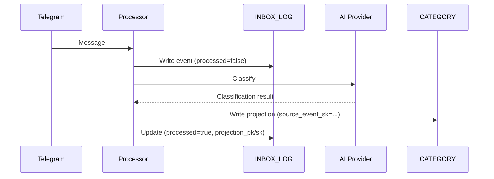

# ADR-005: Event Sourcing with INBOX_LOG

## Status

**Accepted** - 2026-01-17

## Context

The current architecture stores classified items directly as the source of truth. When we want to:
- Add new fields to items
- Improve classification with a better AI model
- Fix bugs in classification logic
- Experiment with different categorization approaches

...we need to write migration scripts or manually update items. The original raw input is preserved in `original_text`, but there's no systematic way to replay all inputs through new logic.

Additionally, there's no complete audit trail of what was captured - only what was successfully classified and stored.

## Decision

Adopt **event sourcing** with INBOX_LOG as the source of truth:

1. **INBOX_LOG** stores every raw message received, exactly as received
2. **Categorized items** (People/Projects/Ideas/Admin) become **projections** derived from events
3. **Replay capability** allows rebuilding all projections from the event log

### Schema Design

#### INBOX_LOG (Source of Truth)

```
PK: "INBOX"
SK: "{timestamp}#{uuid}"

Attributes:
  - raw_text: string          # Original message, unmodified
  - received_at: string       # ISO timestamp when received
  - source: string            # "telegram" | "email" | "voice" (future)
  - source_id: string         # telegram_message_id for deduplication
  - chat_id: string           # Telegram chat ID
  - processed: boolean        # Has this been projected?
  - processed_at: string      # When projection was created
  - projection_pk: string     # FK to derived item (if processed)
  - projection_sk: string     # FK to derived item (if processed)
```

#### Projections (Derived State)

Existing items in CATEGORY#* partitions gain:

```
  - source_event_sk: string   # FK back to INBOX_LOG event
  - classified_at: string     # When classification happened
  - classified_by: string     # Model used: "claude-sonnet-4-20250514"
  - classification_version: int  # Increment on re-classification
```

### Processing Flow

#### Normal Capture (New)

```
1. Receive Telegram message
2. Write to INBOX_LOG (append-only)
   - processed: false
3. Classify with AI
4. Write projection to CATEGORY#*
   - source_event_sk points to INBOX_LOG entry
5. Update INBOX_LOG entry
   - processed: true
   - projection_pk/sk point to derived item
```



#### Replay (Rebuild Projections)

```
1. Scan INBOX_LOG in SK order (chronological)
2. For each event:
   a. Delete existing projection (if any)
   b. Classify with current AI model
   c. Write new projection
   d. Update INBOX_LOG with new projection FK
3. Checkpoint progress for resume capability
```

Options for replay:
- **Full replay**: Delete all projections, rebuild from scratch
- **Incremental**: Only replay events after a certain date
- **Selective**: Only replay events matching a filter (e.g., category="Ideas")
- **Re-classify vs Re-project**: Can skip AI call and reuse stored classification

### Handling AI Non-Determinism

AI classification is non-deterministic:
- Same input may classify differently on replay
- Model versions change over time
- This is a **feature, not a bug** - newer models are better

Design choices:
1. **Accept drift**: Items may shift categories on replay. Latest AI = best classification.
2. **Track lineage**: `classified_by` and `classification_version` show what produced current state.
3. **Optional caching**: Store classification result in INBOX_LOG for "replay without re-classify" mode.

### Replay Script Design

```python
# scripts/replay_inbox.py

def replay(
    start_after: Optional[str] = None,  # Resume from SK
    end_before: Optional[str] = None,   # Stop at SK
    dry_run: bool = False,              # Don't write, just log
    skip_classification: bool = False,  # Reuse stored classification
    delete_existing: bool = True,       # Remove old projections first
):
    """Replay INBOX_LOG events to rebuild projections."""
```

Features:
- Checkpoint file for resume after interruption
- Dry-run mode for testing
- Progress logging with ETA
- Batch processing to manage API rate limits
- Cost estimation before running

### Migration Plan

1. **Phase 1**: Add INBOX_LOG writes to processor (new messages only)
2. **Phase 2**: Add `source_event_sk` to new projections
3. **Phase 3**: Backfill INBOX_LOG from existing items' `original_text`
4. **Phase 4**: Build replay script
5. **Phase 5**: Verify with dry-run replay
6. **Phase 6**: Document and integrate into workflow

## Consequences

### Positive

- **Replayability**: Add new features by replaying, not migrating
- **Complete audit trail**: Nothing is ever lost
- **Schema evolution**: New fields = replay, not ALTER TABLE
- **Experimentation**: Try different AI models, compare results
- **Debugging**: See exactly what was received vs derived
- **Recovery**: Bad classification? Fix logic, replay

### Negative

- **Increased complexity**: Two-phase write, replay infrastructure
- **Storage duplication**: Events + projections (minimal at personal scale)
- **Replay cost**: Full replay = API calls for each event (~$0.50-2.00)
- **Replay time**: 1000 events × 2s = 30+ minutes
- **Non-determinism**: Items may shift categories on replay

### Neutral

- **Eventual consistency**: Projections lag events by milliseconds (acceptable)
- **Learning curve**: Event sourcing is a different mental model

## Alternatives Considered

### 1. Hybrid Approach (Store classification with event)

Store AI classification result in INBOX_LOG, replay uses stored result.

**Rejected because**: Loses the main benefit - re-classifying with better AI.

### 2. Migration Scripts

Write one-off scripts for each schema change.

**Rejected because**: Doesn't scale, error-prone, no audit trail.

### 3. Keep Current Architecture

Just preserve `original_text` as we do now.

**Rejected because**: No systematic replay, no complete audit trail.

## References

- [Event Sourcing pattern (Martin Fowler)](https://martinfowler.com/eaaDev/EventSourcing.html)
- [CQRS pattern](https://martinfowler.com/bliki/CQRS.html)
- [INSPIRATION.md - The Receipt (Audit Trail)](../INSPIRATION.md)
